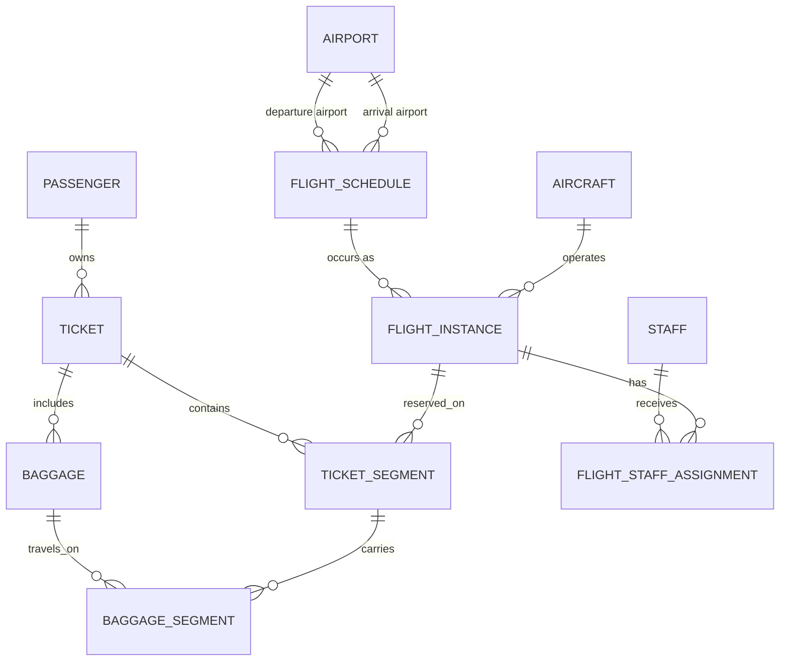

# Database Design

## Entity Relationship Diagram

## Tables and Key Decisions

### Airport

`airport_id` is the primary key. `iata_code` is unique. Airport name, city, and country are stored once, while flight schedules use airport foreign keys.

### Passenger

`passenger_id` is the primary key. The table stores first name, last name, date of birth, email, phone number, and passport number. Email and passport number must be unique when provided.

### Aircraft

`aircraft_id` is the primary key. `registration_number` is unique and identifies the physical aircraft. The table also stores model and capacity. Capacity belongs here because the aircraft assigned to a flight can change.

### Flight Schedule

`schedule_id` is the primary key. A schedule represents a repeatable service, such as AA123 travelling from JFK to LAX. It stores `airline_code`, `flight_number`, `departure_airport_id`, and `arrival_airport_id`.

### Flight Instance

`instance_id` is the primary key. A flight instance represents one real operation of a schedule on a particular date. It stores `schedule_id`, `aircraft_id`, scheduled departure and arrival datetimes, and operational status. This table prevents the incorrect assumption that a flight number appears only once in the system.

### Ticket

`ticket_id` is the primary key. A ticket stores one passenger's overall purchase through `passenger_id`, a unique `booking_reference`, booking time, and ticket status. This project deliberately models one passenger per ticket to keep the scope manageable.

### Ticket Segment

`segment_id` is the primary key. Each row represents one flight leg in a ticket. It stores `ticket_id`, `flight_instance_id`, `segment_number`, `seat_number`, `cabin_class`, `ticket_price`, and segment status. A direct journey has one segment; a journey with a layover has two or more.

### Baggage

`baggage_id` is the primary key. A baggage record belongs to a ticket through `ticket_id` and stores a unique tag number, weight, and overall baggage status. This records ownership and allowance without duplicating passenger data.

### Baggage Segment

`baggage_segment_id` is the primary key. This junction table links a physical bag to each ticket segment on which it travels. It stores `baggage_id`, `ticket_segment_id`, load status, `loaded_at`, and `unloaded_at`. A connecting journey therefore has one baggage-segment row for each flight leg.

### Staff

`staff_id` is the primary key. The table stores staff name, email, phone number, and job title.

### Flight Staff Assignment

`assignment_id` is the primary key. This junction table links staff to a specific `flight_instance`, with a duty such as gate agent, cabin crew, or baggage handler. It supports many staff on one flight and many flight assignments for one staff member.

## Important Constraints

| Constraint | Reason |
|---|---|
| `UNIQUE(schedule_id, scheduled_departure_time)` | Prevents the same schedule being created twice for the same time. |
| `UNIQUE(ticket_id, segment_number)` | Keeps each ticket's flight legs in a clear order. |
| `UNIQUE(flight_instance_id, seat_number)` | Prevents one seat being assigned twice on the same flight instance. |
| `UNIQUE(baggage_id, ticket_segment_id)` | Prevents the same bag being added twice to the same flight leg. |
| `UNIQUE(staff_id, flight_instance_id)` | Prevents duplicate staff assignments for one flight operation. |

## 3NF Check

1. **First Normal Form (1NF):** Each column holds one value. Multiple flight legs and multiple baggage movements are represented by separate rows.
2. **Second Normal Form (2NF):** Every non-key column describes the full row. For example, `loaded_at` describes one bag on one ticket segment.
3. **Third Normal Form (3NF):** Data is not duplicated across tables. Airport details are not repeated in flight schedules; aircraft capacity is not repeated in flight instances; passenger and flight details are not repeated in baggage records.

## Rules to Enforce Later in MySQL

- Departure and arrival airports must be different.
- Scheduled arrival must be later than scheduled departure.
- Aircraft capacity must be greater than zero.
- A seat can be assigned only once per flight instance.
- A ticket segment must refer to an existing ticket and flight instance.
- A baggage segment must refer to existing baggage and a ticket segment.
- A ticket segment can be created only when assigned seats are fewer than the capacity of the instance's aircraft. This check will use a database transaction.
