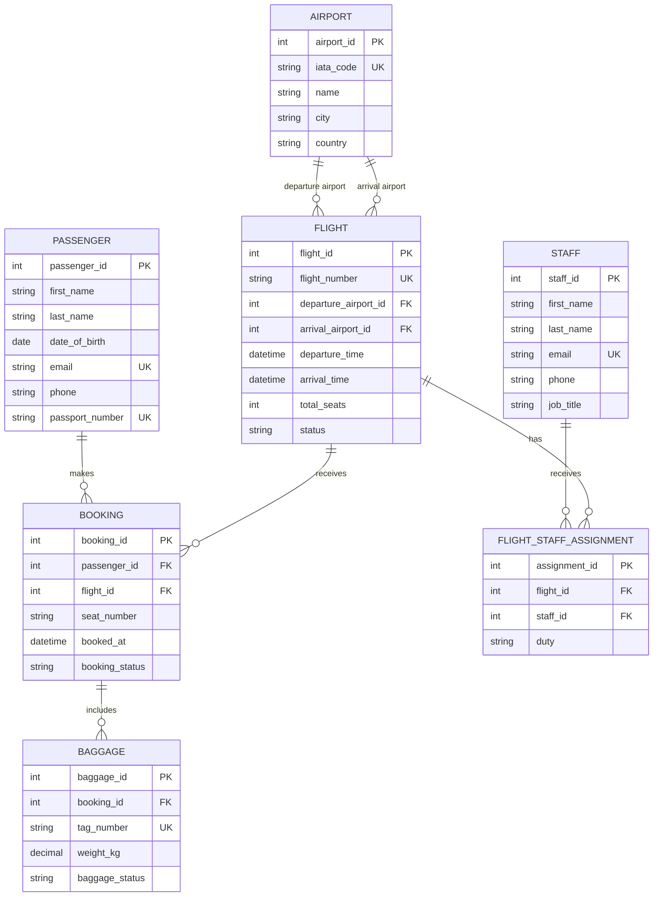

# Database Design

## Entity Relationship Diagram

## Tables and Key Decisions

### Airport

Stores each airport once. A flight refers to two airport records: one for departure and one for arrival.

### Passenger

Stores personal and contact information for each passenger. `email` and `passport_number` must be unique when provided.

### Flight

Stores a flight's schedule, capacity, and operational status. It uses foreign keys for the departure and arrival airports. Available seats are calculated from active bookings instead of stored separately, which avoids inconsistent seat counts.

### Booking

Connects one passenger to one flight. Each booking has one seat number. The combination of `flight_id` and `seat_number` must be unique so that two passengers cannot receive the same seat.

### Baggage

Stores baggage for a booking. It does not store `passenger_id` or `flight_id`, because both can be obtained through the booking; avoiding those duplicate columns helps keep the design normalized.

### Staff

Stores airport staff and each staff member's job title.

### Flight Staff Assignment

Connects staff to flights. This junction table supports the many-to-many relationship: a flight can have several staff members, and a staff member can work on many flights.

## Relationship Summary

| Relationship | Meaning |
|---|---|
| Airport to Flight | One airport can be the departure or arrival airport for many flights. |
| Passenger to Booking | One passenger can create many bookings. |
| Flight to Booking | One flight can have many bookings. |
| Booking to Baggage | One booking can have zero or more baggage items. |
| Staff to Flight | Many-to-many, resolved by `flight_staff_assignment`. |

## 3NF Check

1. **First Normal Form (1NF):** Every column holds one value; repeating groups are separated into rows.
2. **Second Normal Form (2NF):** Every non-key column describes the row's whole primary key.
3. **Third Normal Form (3NF):** Non-key columns do not depend on other non-key columns. For example, baggage does not repeat passenger or flight data, and flight records refer to airport records rather than duplicating airport details.

## Rules to Enforce Later in MySQL

- A flight's departure and arrival airports must be different.
- `arrival_time` must be later than `departure_time`.
- `total_seats` must be greater than zero.
- A seat can be assigned only once per flight.
- Baggage must refer to an existing booking.
- A booking can be created only when active bookings are fewer than `total_seats`; this will be handled in a transaction.
